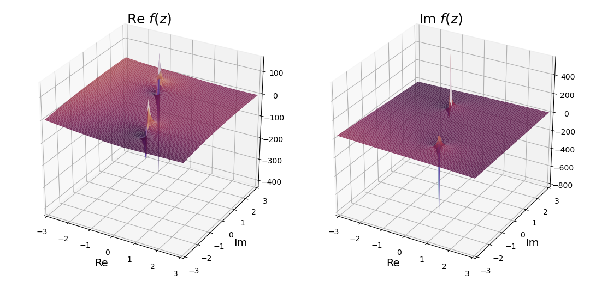

# complex-plotting-tools
Module for plotting complex-valued functions of complex variable using different methods.

## Examples gallery

#### Examples with the function 

 |  
| ------------- | ------------- |
  |  
  |  
  |  
  |  
  |  
  |  

#### Examples with the function 

  |  
| ------------- | ------------- |
  |  
